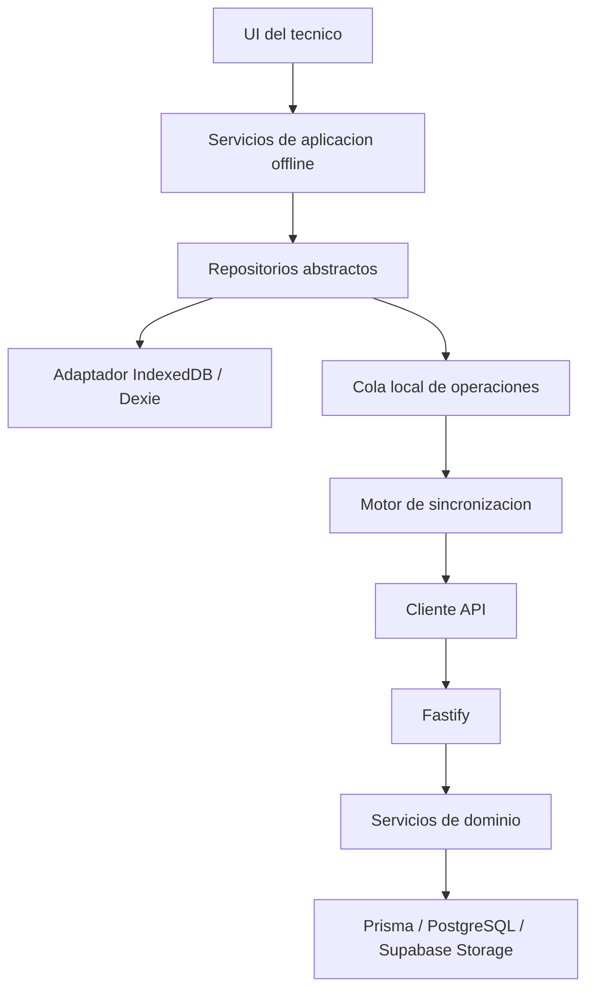

# Arquitectura offline-first para tecnicos

Estado: decision de Fase 1. Sin comportamiento operativo habilitado.

## Contexto y alcance

El piloto agrega una capacidad PWA para tecnicos de Servicios sin reemplazar el flujo conectado. PostgreSQL y la API Fastify conservan la autoridad. El dispositivo solo mantiene una proyeccion temporal de las ordenes asignadas y una cola de eventos pendientes.

Incluye los fundamentos para lectura local, operaciones idempotentes, sincronizacion manual y evidencias diferidas. No incluye bootstrap, IndexedDB real, Service Worker, sincronizacion, evidencias ni cambios visuales en esta fase.

## Componentes y responsabilidades



- La UI invoca casos de uso; nunca importa Dexie.
- Los servicios de aplicacion coordinan lecturas y crean operaciones, sin decidir autorizacion final.
- Los repositorios expresan contratos independientes de navegador, React y almacenamiento.
- El adaptador local implementa transacciones, cuotas, migraciones y limpieza.
- El motor de sincronizacion no contiene React ni logica visual.
- El cliente API transporta lotes y checkpoints; no escribe en Supabase.
- Fastify autentica y revalida ambiente, tenant, usuario, rol, asignacion, estado y version.
- Los servicios de dominio existentes conservan las reglas de Servicios.
- Storage solo recibe evidencia mediante autorizacion, cuarentena y confirmacion.

## Feature flags y aislamiento

Las banderas `OFFLINE_TECHNICIAN_ENABLED`, `OFFLINE_SYNC_ENABLED`,
`OFFLINE_EVIDENCE_UPLOAD_ENABLED` y `OFFLINE_AUTO_SYNC_ENABLED` son falsas ante
ausencia o valor invalido. La decision autoritativa se calcula en servidor:

```text
global AND ambiente permitido AND tenant permitido AND (usuario OR rol permitido)
```

La precedencia es denegatoria: una condicion falsa detiene la evaluacion. Las
listas de tenant, usuario o rol no pueden ampliar una bandera global apagada.
No se configura ningun sujeto permitido en Fase 1.

Con flags apagadas no se importa el adaptador, no se abre IndexedDB, no se
registran listeners, no se consulta API offline y no cambia ninguna ruta o
peticion actual.

## Flujo de lectura

1. La UI conectada continua usando los endpoints actuales.
2. En una fase posterior, la capacidad autorizada solicita bootstrap o pull.
3. El backend devuelve una proyeccion minimizada y un checkpoint.
4. El servicio de aplicacion escribe la proyeccion mediante una transaccion.
5. Sin red, la UI lee mediante repositorios, nunca mediante Dexie directo.
6. Un dato vencido se muestra como no sincronizado y no se considera autoridad.

## Flujo de escritura

1. El caso de uso valida estructura y disponibilidad local.
2. Crea una operacion inmutable con UUID, dispositivo, tenant, usuario, entidad,
   version base y fecha local.
3. La operacion y la proyeccion optimista se guardan en una transaccion local.
4. No se sobrescribe una copia completa de la entidad del servidor.
5. El usuario conserva el evento hasta recibir resultado autoritativo.

## Flujo de sincronizacion manual

1. Reautenticar y obtener capacidad autoritativa del servidor.
2. Ejecutar pull/preflight para detectar revocacion, reasignacion o cancelacion.
3. Enviar lotes pequenos en orden estable por entidad.
4. Procesar un resultado independiente por operacion.
5. Marcar `APPLIED`, `ALREADY_APPLIED`, `RETRYABLE_ERROR`, `REJECTED`,
   `CONFLICT` o `BLOCKED`.
6. Subir evidencias autorizadas de forma individual.
7. Ejecutar pull final y avanzar el checkpoint solo tras persistencia completa.

Un fallo individual no revierte operaciones aceptadas del mismo lote. El
reintento conserva el mismo `operationId`.

## Evidencias

La captura se conserva temporalmente como blob local con hash, MIME, tamano y
relacion a una operacion. El servidor prepara una autorizacion de corta vida,
la carga va a cuarentena privada y la confirmacion valida firma, MIME,
dimensiones, hash, pertenencia y estado de orden antes de promoverla.

No se usa `base64_data`, URL firmada como identidad permanente ni escritura
directa a Storage. El blob local se elimina despues de confirmacion y pull
exitosos. Cuota excedida produce `BLOCKED` sin perder otras operaciones.

## Adaptadores de almacenamiento

`OfflineStorageAdapter` define apertura explicita, transacciones, version de
esquema, migracion, estimacion de cuota y limpieza por tenant/usuario. Dexie
sobre IndexedDB es el adaptador web desde Fase 2 y se importa dinamicamente.

Las interfaces no exponen tipos Dexie. Un adaptador futuro SQLite para
Capacitor implementara el mismo contrato; la logica de aplicacion y sync no
cambiara. Capacidades nativas como camara o tareas de fondo quedaran en puertos
separados y no forman parte del repositorio.

## Observabilidad

- Correlation ID de sincronizacion y `operationId` por evento.
- Conteos por resultado, latencia, bytes, reintentos y antiguedad de cola.
- Auditoria servidor con tenant, usuario, dispositivo, entidad y regla aplicada.
- Logs cliente minimizados, sin tokens, payload de fotos ni PII innecesaria.
- Estado visible futuro derivado de datos, no de mensajes de log.

En Fase 3, capacidades y bootstrap son autoritativos. El endpoint genera una
proyeccion acotada en dos consultas, registra resultado, latencia, cantidad de
ordenes, bytes y consultas, y el cliente la hidrata transaccionalmente. No hay
pull, push ni operaciones locales.

En Fase 4 la cola local existe como modulo aislado y sin transporte. Dexie v3
agrega dos tablas, conserva el snapshot y permite solo `TEST_OPERATION` cuando
un harness automatizado lo habilita explicitamente. No hay integracion React,
mutacion optimista, endpoint push ni cambio en logout productivo.

## Rollback

El rollback inmediato apaga la bandera global. Como los fundamentos no se
conectan al flujo actual, esto evita inicializacion y trafico nuevo. Endpoints y
tablas futuras seran aditivos. Operaciones ya aplicadas no se borran: quedan
auditadas y se revierten solo mediante reglas de negocio existentes.
