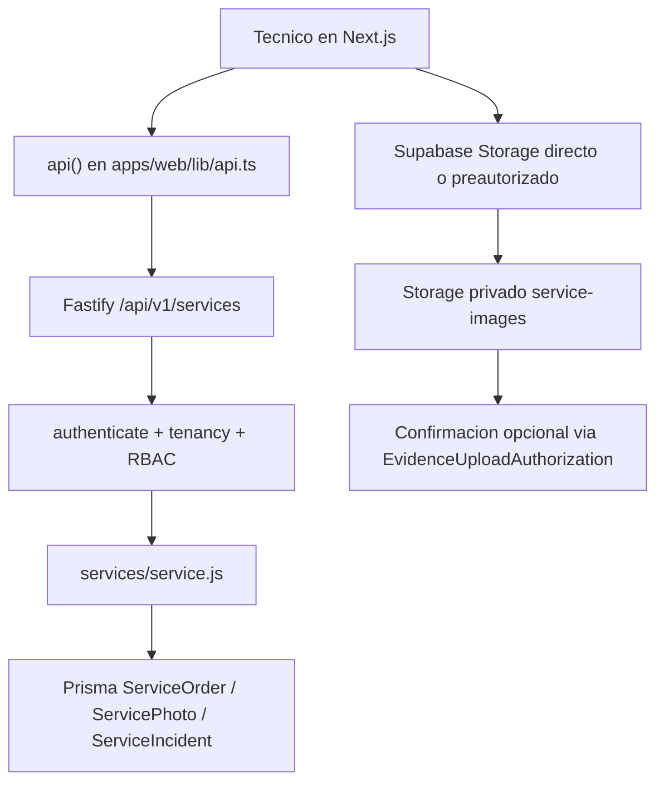
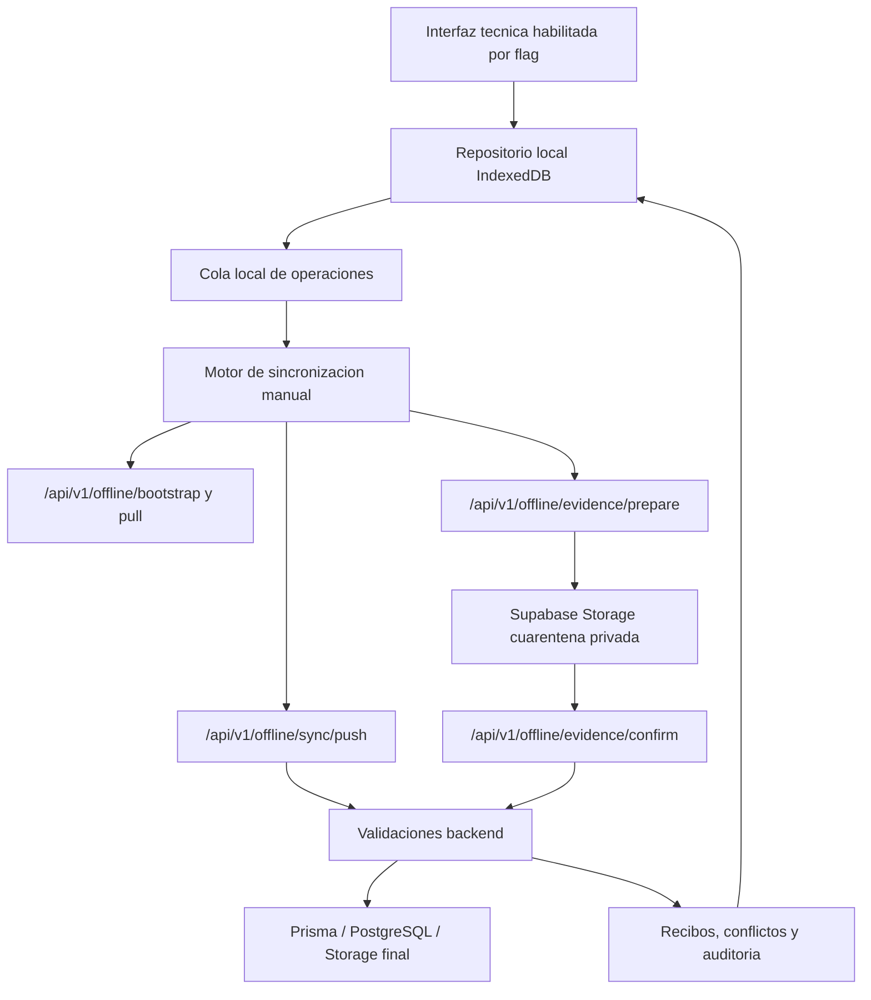

# Offline-first para tecnicos de Servicios - Evaluacion tecnica inicial

Fecha: 2026-07-27
Rama de trabajo: `feature/offline-first-technicians`
Base validada: `origin/develop` en `31d52e5`
Alcance de esta fase: auditoria previa. No se implementan cambios funcionales.

## Registro del proceso

1. Se recibio el alcance offline-first y sus restricciones criticas.
2. Se verifico que el workspace estaba inicialmente en `main`.
3. Se actualizo `origin/develop` desde remoto.
4. Como `develop` local esta usado por otro worktree, se creo la rama `feature/offline-first-technicians` desde el estado actualizado de `origin/develop`.
5. Se corrigio el puntero local de `main` para que volviera a `origin/main`; la rama de trabajo quedo aislada.
6. Se auditaron `package.json`, `apps/api`, `apps/web`, Prisma, Servicios, autenticacion, autorizacion, Supabase Storage, RLS documentado y UI tecnica actual.

## Estado actual

APEXOS es un monorepo con npm workspaces. La aplicacion web vive en `apps/web` con Next.js 15, React 19, TypeScript, React Query, Zustand y utilidades propias en `apps/web/lib`. La API operativa vive en `apps/api` con Fastify 5, Prisma 5 y modulos registrados bajo `/api/v1`.

El modulo de Servicios esta implementado principalmente en:

- `apps/api/src/modules/services/routes.js`
- `apps/api/src/modules/services/service.js`
- `apps/api/src/modules/services/schema.js`
- `apps/api/src/modules/services/evidenceUploads.js`
- `apps/web/app/dashboard/servicios/page.tsx`
- `apps/web/app/dashboard/servicios/[id]/page.tsx`
- `apps/web/lib/api.ts`
- `apps/web/lib/supabaseStorage.ts`

La base Prisma contiene `Tenant`, `User`, `Role`, `Permission`, `AuthorizationSession`, `AuditLog`, `ServiceOrder`, `ServiceReference`, `ServiceReferencePart`, `ServiceIncident`, `ServicePhoto` y `EvidenceUploadAuthorization`.

La autenticacion del API acepta JWT local o token Supabase. Despues revalida estado autoritativo con `authorizationState.validateAuthorization`, incluyendo usuario activo, tenant activo, session revocada, version de usuario y version de tenant. Esta capa es obligatoria para cualquier endpoint offline.

La UI de Servicios ya distingue sesiones de tecnico con `isServiceTechnicianSession()`. En backend, un rol llamado `Tecnico` queda limitado a ordenes con `technician_id` propio y estados `pendiente`, `en_curso`, `inspeccion` o `ejecucion`.

## Flujo actual

Notas del flujo actual:

- Listado: `GET /api/v1/services/orders`.
- Detalle: `GET /api/v1/services/orders/:id`.
- Inicio: `PATCH /api/v1/services/orders/:id/start`.
- Inspeccion: `PATCH /api/v1/services/orders/:id/inspection`.
- Ejecucion: `PATCH /api/v1/services/orders/:id/execution`.
- Cierre exitoso: `PATCH /api/v1/services/orders/:id/close`.
- Cierre no ejecutado: `PATCH /api/v1/services/orders/:id/close-not-executed`.
- Novedades: `POST /api/v1/services/orders/:id/incidents`.
- Evidencias legacy: `POST /api/v1/services/orders/:id/photos`.
- Evidencias autoritativas: autorizacion, carga a cuarentena y confirmacion.

## Entidades involucradas

Necesarias para el tecnico en el piloto:

- `ServiceOrder`: orden asignada, estado, agenda, cliente minimo, coordenadas de inicio/cierre, notas y metadata operacional.
- `ServiceReference`: referencia del producto/servicio.
- `ServiceReferencePart`: piezas para checklist/inspeccion.
- `ServiceIncident`: observaciones y novedades.
- `ServicePhoto`: evidencias registradas.
- `EvidenceUploadAuthorization`: autorizacion de carga, cuarentena, validacion y checksum.
- `User`, `Role`, `Permission`, `Employee`, `Tenant`, `AuthorizationSession`: identidad, permisos, perfil tecnico y revocacion.
- `AuditLog` y logs tecnicos de plataforma: trazabilidad.

Descargable al dispositivo:

- Ordenes asignadas al tecnico autenticado.
- Datos minimos del cliente: nombre, direccion, telefono, documento si la operacion lo exige.
- Referencia y piezas necesarias para inspeccion.
- Estados y metadata operacional necesaria para continuar.
- Evidencias ya registradas como metadata y rutas firmables, no como secretos.
- Preguntas activas de encuesta de satisfaccion.

No descargable:

- Datos de otras empresas.
- Ordenes de otros tecnicos.
- Administracion, roles, usuarios, contabilidad, inventario, compras, facturacion o reportes gerenciales.
- Tokens, refresh tokens o service role keys dentro del repositorio local offline.
- Informacion empresarial no necesaria para ejecutar la orden.

## Acciones offline candidatas

Permitidas para piloto, siempre como operaciones en cola y revalidadas por backend:

- `SERVICE_STARTED`
- `ACTIVITY_COMPLETED` / avance de inspeccion o ejecucion
- `CHECKLIST_UPDATED`
- `OBSERVATION_ADDED`
- `EVIDENCE_CAPTURED`
- `SERVICE_COMPLETION_REQUESTED`
- `LOCATION_EVENT_RECORDED`

Solo en linea:

- Crear o reasignar ordenes.
- Cambiar roles, usuarios, permisos, empresas o maestros globales.
- Cancelar ordenes desde administracion.
- Promover evidencia a Storage final sin confirmacion backend.
- Resolver conflictos criticos.
- Ejecutar reportes gerenciales o exportes.

## Riesgos

| Riesgo | Severidad | Observacion | Mitigacion propuesta |
| --- | --- | --- | --- |
| Fallback Supabase directo desde frontend | Alta | `apps/web/lib/api.ts` contiene fallbacks a Supabase para multiples flujos. Offline no debe apoyarse en escritura directa a Supabase. | Crear endpoints offline dedicados y prohibir uso de fallback Supabase en sync. |
| Evidencias legacy en base64 | Alta | `ServicePhoto` todavia acepta `base64_data` por compatibilidad. | Offline debe usar autorizacion/cuarentena/confirmacion y guardar solo referencia local temporal hasta confirmacion. |
| Falta version explicita en `ServiceOrder` | Alta | Existe `updated_at`, pero no `version` monotona por entidad. | Migracion aditiva posterior para versionado o control optimista equivalente. |
| Estados sin maquina formal centralizada | Media | Las transiciones viven en funciones del servicio y UI. | Extraer reglas compartidas o validador backend para sync idempotente. |
| Doble identidad Prisma/Supabase | Alta | Docs indican control dual entre Prisma/API y Supabase. | Sync offline debe usar identidad API revalidada y mapear `tenant_id`/`company_id` de servidor. |
| Sesion expirada offline | Alta | La UI actual limpia sesion por inactividad local. | Definir modo offline: lectura local permitida limitada, sync bloqueado hasta reautenticar. |
| Concurrencia supervisor/tecnico | Alta | Supervisor puede cancelar/reasignar mientras tecnico esta offline. | Pull antes de push o preflight por orden; operaciones bloqueadas si cambio critico. |
| Tamano de IndexedDB/evidencias | Media | Fotos pueden crecer y fallar por cuota de navegador. | Compresion controlada, limites por lote, estado `BLOCKED` por almacenamiento. |
| Crecimiento de cola servidor | Media | Operaciones idempotentes requieren retencion y limpieza. | Tablas con indices, TTL operativo y limpieza programada. |

## Dependencias

- IndexedDB mediante libreria estable. Recomendacion inicial: Dexie por madurez, transacciones y tipado razonable en frontend.
- Endpoints Fastify versionados bajo `/api/v1/offline/...`.
- Prisma para tablas aditivas: dispositivos, operaciones, recibos, conflictos y checkpoints, si no existe equivalente reutilizable.
- Supabase Storage solo a traves del flujo de autorizacion/cuarentena/confirmacion.
- Feature flags en ambiente, tenant y usuario/rol.
- Pruebas Node `node --test`, validacion Prisma, lint/typecheck web y pruebas funcionales manuales en Nyvora QA.

## Flujo offline propuesto

Orden inicial recomendado:

1. Validar sesion, usuario, tenant, rol, permiso y dispositivo.
2. Pull/bootstrap de ordenes asignadas y metadatos minimos.
3. Detectar cancelaciones, reasignaciones o bloqueos.
4. Enviar operaciones idempotentes en lote pequeno.
5. Registrar recibo por operacion.
6. Preparar/subir/confirmar evidencias una por una.
7. Pull final para dejar el repositorio local consistente.

## Endpoints actuales reutilizables

- Lectura de ordenes y detalle para comparar DTOs, no como mecanismo final de bootstrap offline.
- Transiciones actuales de servicio como fuente de reglas de negocio.
- Evidencias preautorizadas actuales para diseno de prepare/confirm offline.
- Auth y authorization state existentes.

## Endpoints nuevos necesarios

Nombres propuestos sujetos a ajuste:

- `GET /api/v1/offline/bootstrap`
- `GET /api/v1/offline/sync/pull`
- `POST /api/v1/offline/sync/push`
- `GET /api/v1/offline/sync/status`
- `POST /api/v1/offline/evidence/prepare`
- `POST /api/v1/offline/evidence/confirm`
- `POST /api/v1/offline/devices/register`

Todos deben validar sesion, usuario activo, tenant activo, versiones de autorizacion, rol, permisos, empresa, tecnico asignado, estado actual, version base, idempotencia, tamano de payload y pertenencia de evidencia.

## Feature flags propuestos

Desactivados por defecto:

- `OFFLINE_TECHNICIAN_ENABLED`
- `OFFLINE_SYNC_ENABLED`
- `OFFLINE_EVIDENCE_UPLOAD_ENABLED`
- `OFFLINE_AUTO_SYNC_ENABLED`

Niveles de resolucion:

- Ambiente: variables de entorno.
- Tenant/empresa: `Tenant.config.offline`.
- Usuario/rol: `User.preferences.offline` o metadata de rol, si se aprueba.

Piloto: solo empresa interna Nyvora QA.

## Modelo local propuesto

Repositorios:

- `LocalOrderRepository`
- `LocalActivityRepository`
- `LocalChecklistRepository`
- `LocalEvidenceRepository`
- `SyncQueueRepository`
- `SyncMetadataRepository`

Cada registro local debe incluir:

- `localId`
- `serverId`
- `entityType`
- `entityVersion`
- `companyId`
- `userId`
- `createdAtLocal`
- `updatedAtLocal`
- `serverUpdatedAt`
- `syncStatus`
- `lastSyncAttempt`
- `retryCount`
- `lastSyncError`

Estados: `LOCAL_ONLY`, `PENDING`, `SYNCING`, `SYNCED`, `FAILED`, `CONFLICT`, `BLOCKED`.

## Migraciones candidatas

No crear en Fase 0. Para fases posteriores, evaluar si ya existen equivalentes antes de agregar:

- `OfflineDevice`
- `OfflineSyncOperation`
- `OfflineSyncReceipt`
- `OfflineConflict`
- `OfflineSyncCheckpoint`

Todas deben ser aditivas, reversibles, indexadas por tenant/empresa/usuario, con retencion y limpieza.

## Matriz inicial de conflictos

| Caso | Politica propuesta |
| --- | --- |
| Orden cancelada por supervisor mientras tecnico esta offline | Bloquear operaciones pendientes y marcar `CONFLICT` o `BLOCKED`; no perder datos locales. |
| Orden reasignada | Operaciones del tecnico anterior quedan bloqueadas. |
| Estado servidor avanza a finalizado | No aceptar operaciones que cambien cierre; preservar cola local para revision. |
| Evidencia duplicada | Usar hash, idempotency key y `client_upload_id`; devolver recibo si ya fue aceptada. |
| Checklist con version base vieja | Generar conflicto por entidad, no aplicar ultimo cambio gana. |
| Usuario/tenant revocado | Bloquear sync, limpiar o sellar datos locales segun politica de seguridad aprobada. |
| URL firmada expirada | Reintentar prepare y continuar carga individual. |

Documento dedicado pendiente: `docs/offline/OFFLINE_CONFLICT_MATRIX.md`.

## Estrategia de implementacion

1. Completar documentacion base y aprobacion de alcance.
2. Agregar feature flags sin activar comportamiento.
3. Agregar dominio local offline en frontend sin conectar UI productiva.
4. Agregar cola de operaciones e idempotencia cliente.
5. Agregar modelos Prisma aditivos, si aplica.
6. Agregar endpoints offline protegidos.
7. Integrar bootstrap/pull manual.
8. Integrar push manual.
9. Integrar evidencias resilientes con cuarentena.
10. Agregar estados visuales offline para tecnicos habilitados.
11. Ejecutar pruebas unitarias, integracion y funcionales en Nyvora QA.

## Estrategia de rollback

- Mantener flags apagados por defecto.
- Si hay incidente, desactivar `OFFLINE_TECHNICIAN_ENABLED` y `OFFLINE_SYNC_ENABLED`.
- No modificar ni retirar endpoints existentes de Servicios.
- No alterar contratos existentes.
- Las migraciones posteriores deben tener rollback por tabla/indice nuevo sin tocar columnas actuales.
- Las operaciones offline aceptadas por backend deben quedar auditadas; rollback funcional no debe borrar datos operativos ya sincronizados sin revision.
- Si una fase falla validacion critica, no avanzar a la siguiente fase ni hacer push.

## Decisiones pendientes

- Confirmar libreria IndexedDB: Dexie recomendado.
- Definir si `entityVersion` sera campo nuevo por tabla o derivado inicialmente de `updated_at`.
- Definir modelo exacto tenant/company para Nyvora QA en offline.
- Confirmar si se permitira lectura offline cuando la sesion local expire pero no haya red.
- Definir retencion de cola local y servidor.
- Definir mecanismo de inspeccion/exportacion de conflictos.
- Definir si el piloto seguira como PWA web o si se preparara despues Capacitor + SQLite.

## Alcance aprobado para piloto

Incluido:

- Ordenes asignadas al tecnico de Servicios.
- Datos minimos del cliente.
- Referencia y piezas.
- Inicio de servicio.
- Inspeccion/checklist.
- Observaciones/novedades.
- Evidencias fotograficas.
- Coordenadas de eventos autorizados.
- Solicitud de finalizacion.
- Estados de sincronizacion.

Excluido:

- Administracion, usuarios, roles, empresas, maestros globales, inventarios, compras, facturacion, contabilidad, reportes gerenciales, operaciones masivas y eliminaciones destructivas.

## Recomendacion PWA vs Capacitor

Para el piloto, continuar como PWA/Next.js con IndexedDB es razonable porque reduce alcance, permite rollback por feature flag y evita introducir un runtime movil nuevo antes de validar reglas de sincronizacion. Capacitor + SQLite debe evaluarse despues si las pruebas reales muestran limites de cuota de IndexedDB, necesidad fuerte de background sync nativo, camara/GPS mas controlados o operacion prolongada en campo con evidencias pesadas.

## Resultado de Fase 0

La arquitectura offline-first es viable si se implementa como carril paralelo, protegido por flags, con backend autoritativo e idempotencia estricta. El mayor trabajo no esta en persistir localmente, sino en cerrar correctamente seguridad, conflictos, evidencias y compatibilidad con el flujo web conectado actual.
