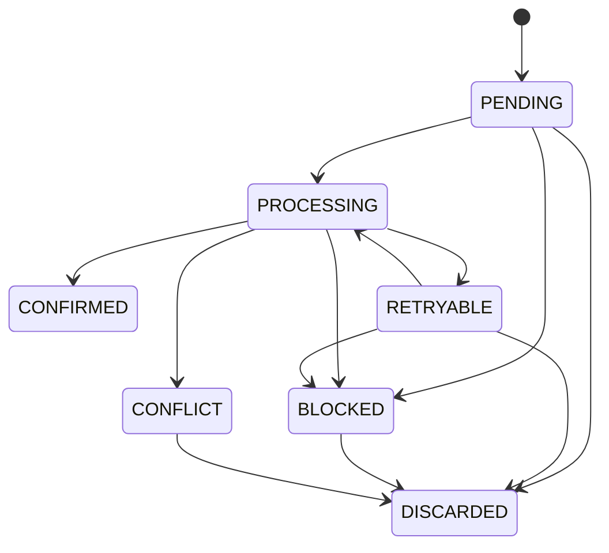

# Maquina de estados de operaciones

`CONFIRMED` y `DISCARDED` son finales. `CONFLICT` solo se modela con fixtures;
no existe deteccion contra servidor. Toda transicion ocurre en una transaccion
local y conserva `operationId`, `idempotencyKey` y secuencia.

Una dependencia debe existir en el mismo contexto. Solo una operacion cuyos
padres estan `CONFIRMED` es ejecutable. Un padre bloqueado, conflictivo o
descartado bloquea a la hija. La insercion solo referencia operaciones previas,
lo que junto con el rechazo de autorreferencia impide ciclos.
